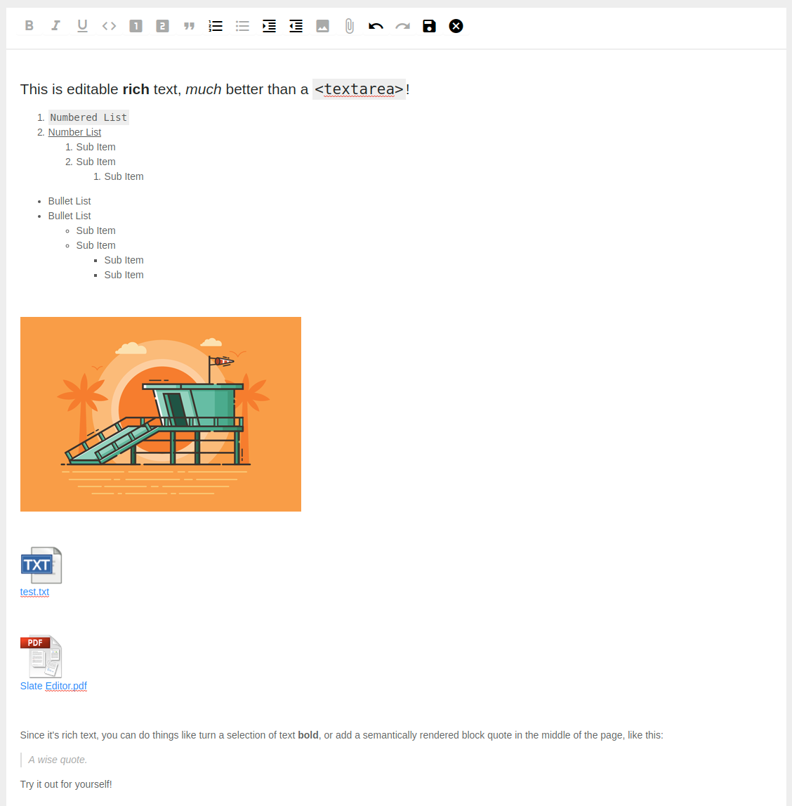

# slate-editor-mini-rich-text
A slate editor with minimal feature

## Quick Start
- clone repository: `git clone https://github.com/shamrat17/slate-editor-mini-rich-text.git`
- install dependency using `npm install`
- run project `npm start`
- brows it on `localhost:3344`

## Editor Actions
### Toolbar Actions
- `Bold`: Bold the selected text
- `Italic`: Italic the selected text
- `Underline`: Underline the selected text
- `Code`: Code mark the selected text
- `Heading One`: Heading one the line
- `Heading Two`: Heading two the line
- `Quote`: Quote the line
- `Numbered List`: Numbered Listing with multi-level hierarchy
- `Bullet List`: Bullet Listing with multi-level hierarchy
- `Shift Right`: Shift right the list
- `Shift Left`: Shift left the list
- `Image`: Attach Image
- `File`: Attach pdf and text file
- `Undo`: Undo editing
- `Redo`: Redo editing
- `Save`: Save all content including file and image to browser local storage
- `Cancel`: Restore the default content

### Keyboard Actions
- `ctrl+b`: Bold the selected text
- `ctrl+i`: Italic the selected text
- `ctrl+u`: Underline the selected text
- `ctrl+`\`: Code mark the selected text
- `tab`: Shift right the list
- `shift+tab`: Shift left the list

### Editor View

